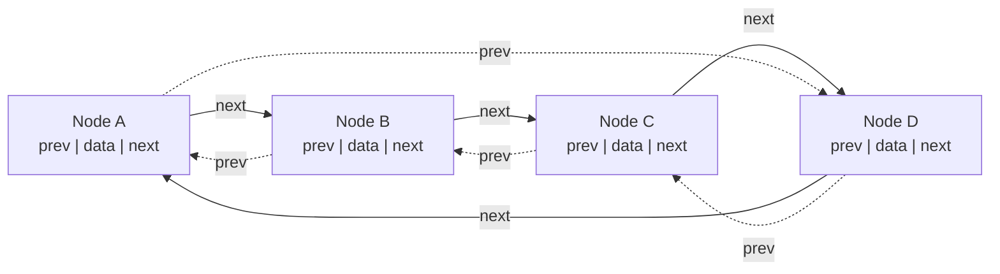

## Objective


| Day       | Task (≈30 min)                                                                                                                                                                                       |
| --------- | ---------------------------------------------------------------------------------------------------------------------------------------------------------------------------------------------------- |
| Mon       | Implement `container_of(ptr, type, member)` yourself using `offsetof`. Write a tiny demo proving it recovers the outer struct from a pointer to a member. **This is THE kernel idiom — don't skip.** |
| Tue       | Circular doubly linked list, kernel-style: the `struct list_head { *next, *prev }` is _embedded inside_ your data struct, not the other way around. Write `list_init`, `list_add`.                   |
| Wed       | Add `list_del`, `list_for_each`, and a `list_entry` macro built on your `container_of`.                                                                                                              |
| Thu       | **Ring buffer** (power-of-two size, head/tail indices, index with `& (size-1)`): `rb_put`, `rb_get`, full/empty detection.                                                                           |
| Fri       | Hash table with chaining, using your kernel-style list as the bucket chains.                                                                                                                         |
| Sat (lab) | Read [`include/linux/list.h`](https://github.com/torvalds/linux/blob/master/include/linux/list.h) top to bottom — you'll understand all of it now. Compare with yours.                               |
| Sun       | Rest / catch-up. Phase 1 done — you now write C the way the kernel does.                                                                                                                             |

## Progress Log

- 2026-08-02: Contract initialized

# Monday 

## Solution

## Notes
- Should return a pointer but instead uses `({})` block with two statments in it, this i GNU extension called **braced group within expression**. The compiler evals the whole block and uses the value of the last statement contained in the block
- Basically GCC lets us wrap a block in parentheses, so the whole thing acts like one expression 
- The last statement is the return value
- `typeof` takes one arg and returns its type so `int`, `double`, etc.
### Zero Pointer Dereference

```c 
struct s {
        char m1;
        char m2;
};

/* This will print 1 */
printf("%d\n", &((struct s*)0)->m2);
```

**The Struct**:
```c
struct s {
    char m1;   // 1 byte, sits at offset 0
    char m2;   // 1 byte, sits at offset 1
};
```

**The Expression**:
```c
&((struct s*)0)->m2
```

**1. `(struct s*)0`**  
Take the integer `0` and reinterpret it as a `struct s *`. This doesn't read any memory — it's just telling the compiler "pretend there's a `struct s` sitting at address `0`." No struct actually needs to exist there for this cast to happen.

**2. `((struct s*)0)->m2`**  
This says "get me the `m2` field of the struct at address `0`." If this were actually _evaluated_ (i.e., its value read), the CPU would compute address `0 + offset_of(m2)` = `0 + 1` = `1`, then try to read a byte from memory address `1` — which would crash, since that's not valid memory.

**3. `&(...)`**  
But we never ask for the _value_ at that address — we ask for the **address itself**, via `&`. And computing an address is just arithmetic: `base_address + offset`. The compiler doesn't need to touch memory location `1` to know its address is `1` — it just does the math:

```C
address of m2 = address of struct (0) + offset of m2 within struct (1) = 1
```

No memory read happens. The CPU never tries to access address `1`. It's purely computing a number.

**4. `printf("%d\n", ...)`**  
So `&((struct s*)0)->m2` evaluates to the pointer value `1` (as an address), and printing it as `%d` just shows the number `1`.

---

## Notes Continued

- `((type *)0)->member` is an expression that, _if actually executed_ (read or write), would try to access address `offset` and crash. But `typeof(...)` never executes it — it only inspects what _type_ the expression would have, entirely at compile time, so no memory access — read or write — ever happens.
- Think of `typeof` like asking someone "if you _were_ to open that door, what room would be behind it?" — you get the answer without ever actually opening the door.
- Basically cast 0 as `type *` so whatever that input is then it uses we grab the type of the member from whatever was re-interpreted in the `(type *) 0`
- `__mptr` is just a variable name the macro invents, not anything special in the language

> [!important] why we need the weird cast 0
>-   `typeof` needs an expression not a type name
>-  `typeof` doesn't work on types directly — it works by looking at an **expression** and asking "what type would this expression evaluate to?"

- `offsetof` grabs the offset starting from address 0
- the `container_of` macro returns the starting address of a struct

To tie the whole thing together end to end:

```c
#define container_of(ptr, type, member) ({ \
    const typeof(((type *)0)->member) *__mptr = (ptr); \
    (type *)((char *)__mptr - offsetof(type, member)); \
})
```

1. `__mptr = (ptr)` — store the incoming pointer (which points at some `member` field _inside_ a struct), with type-checking via `typeof`.
2. `(char *)__mptr - offsetof(type, member)` — take that member's address and walk backward by the member's offset, landing on the struct's starting address.
3. `(type *)(...)` — cast that address to a proper `type *`, so you get back a correctly-typed pointer to the whole struct.
4. The `({ ... })` statement-expression makes the **last statement's value** — that final casted pointer — the value the entire macro evaluates to.

That's the whole purpose of the macro: **given a pointer to a member, recover a pointer to the struct that contains it.** This is heavily used in the Linux kernel for things like intrusive linked lists, where a generic `struct list_head` is embedded inside many different larger structs, and you need to get back to "which struct actually owns this list node."

Given a pointer to a field somewhere inside a struct, and knowing what struct type it's supposedly part of and which field it is, walk backward by exactly that field's offset to recover a pointer to the struct itself.

```c
#include <stdio.h>
#include <stdlib.h>
#include <stddef.h>
#define container_of(ptr, type, member) ({ \
	const typeof ( ((type *)0)->member) *__mptr = (ptr); \
	(type *) ( ( char *)__mptr - offsetof(type, member ) ) ; } )	
struct s {
        char m1;
        char m2;
};
int main(){
	int x = 5;
	typeof(x) y = 6;
	printf("%d %d\n", x, y);
	printf("%d\n", &((struct s*)0)->m2);
	struct s *s2 = malloc(sizeof (struct s));
	char *m1_ptr = &s2->m1;//char * since member var is char
	struct s *s3 = container_of(m1_ptr, struct s, m1);
	return 0;
}
```

# Tuesday

- Basically this returns the address of the struct right like it's original address. So every node is paired with a task right in this linked list. Then since we grab the original address for each task and print out their values

### Circular Doubly Linked List Visual



## Solution
```c
#include <stdio.h>
#include <stdlib.h>
#include <stddef.h>

#define container_of(ptr, type, member) ({ \
	const typeof ( ((type *)0)->member) *__mptr = (ptr); \
	(type *) ( ( char *)__mptr - offsetof(type, member ) ) ; } )

typedef struct list_head{
	struct list_head *next; 
	struct list_head *prev;
} list_head;
static inline void list_init(list_head *head){
	head->next = head;
	head->prev = head;
}
/*Do this by hand if need confirmation*/
static inline void list_add(list_head *head, list_head *new){
	list_head *next = head->next; // next = head ( not NULL - head points to itself)

	new->prev = head; //A.prev = head
	new->next = next; //A.next = head (since next was head)
	next->prev = new; // head->prev = A <-- this is head.prev, since next = head
	head->next = new; // head.next  = A
}

static inline void list_add_tail(list_head *head, list_head *new){
	list_add(head->prev,new);
}
static inline void list_del(list_head *entry){
	list_head *prev = entry->prev;
	list_head *next = entry->next;

	prev->next = next;
	next->prev = prev;
}

typedef struct task{
	int pid;
	char name[16];
	struct list_head node;
} task;

int main(){
	list_head tasks; // anchor not embedded in any task

	list_init (&tasks);
	task t1 = { .pid = 1, .name = "alice"};
	task t2 = { .pid = 2, .name = "bob"};
	task t3 = { .pid = 3, .name = "carol"};

	list_add (&tasks, &t1.node);
	list_add (&tasks, &t2.node);
	list_add (&tasks, &t3.node);

	list_head *pos;
	for (pos = tasks.next; pos != &tasks; pos = pos->next){
		task *t = container_of(pos, task, node);
		printf("pid=%d, name=%s\n",t->pid,t->name);
	}
	return 0;
}
```

# Wednesday

- The rule of thumb: **if the thing needs a `type` argument to compute an offset or produce a typed pointer, it has to be a macro. If it only moves `list_head` pointers around, it should be a function.**
- **Issue 1: You wrapped it in `({ ... })`.** That's a GNU statement-expression (same trick your `container_of` uses) — it's for when a macro needs to _produce a value_, like `container_of` producing a pointer. (I fucked up) 
- Macros run in preprocessing time 
```c
source.c  →  [preprocessor]  →  expanded source (pure C, no macros)  →  [compiler]  →  object code  →  [linker]  →  executable
```
- **Rule of thumb:** ask "does this macro need to produce a value I can assign or pass around?" If yes → it needs to be an expression, possibly via `({ })`. If it's meant to expand into control flow (a loop, a branch) that the call site completes with its own body → it should be a bare statement, no `({ })` wrapper.
- . Plain `( )` (no braces) always means "this is an expression" in C's grammar.

## Solution

```c
#include <stdio.h>
#include <stddef.h>

#define container_of(ptr, type, member) ({ \
	const typeof ( ((type *)0)->member) *__mptr = (ptr); \
	(type *) ( ( char *)__mptr - offsetof(type, member ) ) ; } )

#define list_for_each(pos, head) \
    for (pos = (head)->next; pos != (head); pos = pos->next)

#define list_entry(ptr, type, member) container_of(ptr, type, member)

typedef struct list_head{
	struct list_head *next; 
	struct list_head *prev;
} list_head;
static inline void list_init(list_head *head){
	head->next = head;
	head->prev = head;
}
/*Do this by hand if need confirmation*/
static inline void list_add(list_head *head, list_head *new){
	list_head *next = head->next; // next = head ( not NULL - head points to itself)

	new->prev = head; //A.prev = head
	new->next = next; //A.next = head (since next was head)
	next->prev = new; // head->prev = A <-- this is head.prev, since next = head
	head->next = new; // head.next  = A
}

static inline void list_add_tail(list_head *head, list_head *new){
	list_add(head->prev,new);
}
static inline void list_del(list_head *entry){
	list_head *prev = entry->prev;
	list_head *next = entry->next;

	prev->next = next;
	next->prev = prev;
}

typedef struct task{
	int pid;
	char name[16];
	struct list_head node;
} task;

int main(){
	list_head tasks; // anchor not embedded in any task

	list_init (&tasks);
	task t1 = { .pid = 1, .name = "alice"};
	task t2 = { .pid = 2, .name = "bob"};
	task t3 = { .pid = 3, .name = "carol"};

	list_add (&tasks, &t1.node);
	list_add (&tasks, &t2.node);
	list_add (&tasks, &t3.node);

	list_head *pos;

	list_for_each(pos, &tasks){ 
		task *t = container_of(pos, task, node);
		printf("pid=%d, name=%s\n",t->pid,t->name);
	}
	return 0;
}
```

# Thursday

- So RB_SIZE is chosen to be a power of 2 since this allows for basic bit arithmetic to handle wrapping around indexs

**Why it works, concretely**

Say `RB_SIZE = 16`. In binary, `16 - 1 = 15 = 0b00001111`.

Now take any index, say `head = 37`. In binary: `37 = 0b00100101`.

```
   00100101   (37)
 & 00001111   (15, i.e. RB_SIZE-1)
 ----------
   00000101   (5)
```

`37 & 15 = 5`. And indeed `37 % 16 = 5` too — same answer. The mask just "keeps the low 4 bits and zeroes everything above," which is _exactly_ what mod-16 does, because 16 is `2^4`.

This only works because `size - 1` is a run of all-1-bits (`00001111`), which only happens when `size` itself is a power of two (`16 = 0b00010000`). If `size` were, say, 12, then `size - 1 = 11 = 0b1011` — masking with that does _not_ give you the same result as `% 12`. Try it: `37 & 11 = 1`, but `37 % 12 = 1`... coincidence for that number, but it breaks for others, e.g. `20 & 11 = 0` while `20 % 12 = 8`. So the trick is only valid for power-of-two sizes.

**So to directly answer your question:**

- The array itself is `RB_SIZE` slots (16, 64, 256, whatever) — fixed, chosen up front.
- `head` and `tail` are just counters that keep incrementing forever (1, 2, 3, ..., 36, 37, 38...) — they do _not_ get rounded or wrapped themselves.
- Only when you actually touch the array — `rb->buf[rb->head & (RB_SIZE - 1)]` — do you fold that ever-growing counter down into the valid range `[0, RB_SIZE-1]`. That's the "index into the array" step, and masking is a fast way to do that folding _because_ the array size is a power of two.

So: buffer size → power of two (chosen by you). Index value → arbitrary, unbounded, grows freely. Masking → the fast way to map that arbitrary index into the buffer's valid slot range.

## Solution 

```c
#include <stdint.h>
#include <stddef.h>
#include <stdlib.h>
#include <stdio.h>

#define RB_SIZE 16

typedef struct{
	uint8_t buf[RB_SIZE];
	uint32_t head;
	uint32_t tail;
} ring_buffer_t;
static inline int rb_is_full(const ring_buffer_t *rb){
	return (rb->head - rb->tail) == RB_SIZE;
}
static inline int rb_is_empty(const ring_buffer_t *rb){
	return (rb->head == rb->tail);
}
int rb_put(ring_buffer_t *rb, uint8_t data){
	if (rb_is_full(rb)){return -1;}
	rb->buf[rb->head & (RB_SIZE-1)] = data;
	rb->head++;
	return 0;
}
int rb_get(ring_buffer_t *rb, uint8_t *data){
	if (rb_is_empty(rb)){return -1;}
	*data = rb->buf[rb->tail & (RB_SIZE-1)];
	rb->tail++;
	return 0;
}

int main(){
	ring_buffer_t *rb = calloc(1,sizeof(ring_buffer_t));
	uint8_t data = 10;
	for (uint8_t i = 0; i < 10; i++)
		rb_put(rb,i);
	uint8_t output;
	rb_get(rb,&output);
	printf("output: %d\n", output);
	rb_get(rb,&output);
	printf("output: %d\n", output);
}
```

- `inline` avoids function call overhead
- 