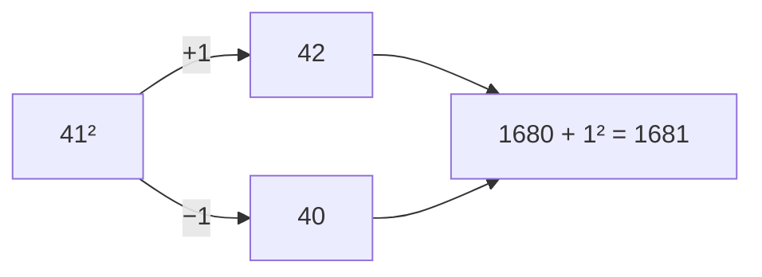
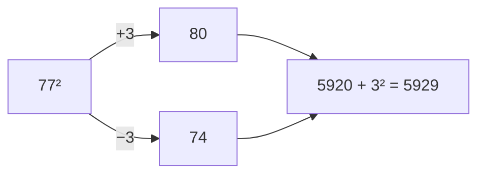

## Why I'm Reading This

To improve my mental math skills

---

# Chapter 1
## Left To Right Addition 

- Read addition **LEFT TO RIGHT** NOT RIGHT TO LEFT
- Add from left to right
Ex:
	$84+57$
1. First add 50
Result:$134+7$
2. Then add 7
Result:$141$
---
## Left To Right Subtraction

- Subtract whole numbers from left to right similar to addition 
Ex:
$53 - 28$
1. Round up so $28$ becomes $30$
2. Subtract $53-30$
3. Result $23$
4. Add back $2$
5. Result $25$

>[!important] Rounding
**Round Up** means add back to result
**Rounding Down** means subtract what was rounded from result

## 3 Digit Subtraction

**Use Complements**
- How far from 100 are certain numbers
Ex:

$$
\begin{array}{r}
37 \\
+63 \\
\hline
100

\end{array}
$$
The key idea is that the **first digit adds up to 9** and the **second digit adds up to 10**

This makes the mental math with 3 digit subtraction easy
$$
\begin{array}{r}
725 \\
\underline{-\ 468 } & \ (500-32)
\end{array}
$$
1. Subtract $500$
2. Result $225$
3. Add back complement so $32$
4. Result $257$

---
# Chapter 2

## 2 By 1 Multiplication

$$
\begin{array}{r}
42 & \ (40+2) \\ 
\times7 \\
\hline
40\times7=280\\
2\times7=+14\\
\hline
294

\end{array}
$$
- Same concept of breaking up from left to right
- Make sure to add 0's based on digit place
- Multiplication with 5 is easier since ends in 0 or 5

## Rounding Up
- Rounding helps but only when rounding numbers that end with an 8 or 9
### Normal
$$
\begin{array}{r}
69 & \ (60+9) \\ 
\times 6 \\
\hline
60\times6=360\\
9\times6=+54\\
\hline
414
\end{array}
$$
### Rounded Up 9
$$
\begin{array}{r}
69 & \ (70-1) \\ 
\times 6 \\
\hline
70\times6=420\\
-1\times6=-6\\
\hline
414
\end{array}
$$
### Rounded Up 8
$$
\begin{array}{r}
78 & \ (80-2) \\ 
\times9 \\
\hline
80\times9=720\\
-2\times9=-18\\
\hline
702
\end{array}
$$
---
## 3 By 1 Multiplication

- Same process as the 2 digit but there is an extra 0
- Difficult part is remember the first sum, with time this will get easier, no trick

## Squaring Two Digit Numbers

- So you try to round a value to it's nearest 10

Ex:

- Notice how we add a number to make it whole 
- Then that number we add just square since 1 digit is easy

# Chapter 3 

## 2 by 2 Multiplication

### Addition Method

- Break up problem to perform 2 by 1 multiplication
$$
\begin{array}{r}
46 \\
\times 42 & (40+2) \\
\hline
40\times 46 =1840\\
2\times46=92\\
\hline
1932
\end{array}
$$
- How to decide which number to break up numerator or denominator?
	- Try to choose the number that will produce the easier addition problem
	- Most cases **break up the number with the smaller last digit** since usually produces a smaller second number for you to add
- Always break up number that ends in 1
- If both numbers end in the same digit **break up the larger number**
$$
\begin{array}{r}
84 & (80+4) \\
\times 34 \\
\hline
80\times 34 =2720\\
4\times34=136\\
\hline
2856
\end{array}
$$

- If one number is much larger than the other, often pays to break up the larger number even if it has the larger last digit
- When multiply a number in the 50's break the number in the 50's
- **Always round it down** (I think)

> [!danger] Wrong page number in pdf
> - Pg 216 found on page 57

### 11 multiplication trick

 $42 \times 11$
 1. $4+2=6$ 
 2. place 6 in between 42 so $462$
 - If need to cary i.e greater than 10 add it to the left most value

### Subtraction Trick

$$
\begin{array}{r}
59 & (60-1) \\
\times 17 \\
\hline
60\times 17 =1020\\
-1\times17=-17\\
\hline
1003
\end{array}
$$

- **Useful when want to multiply ends in 8 or 9**
- Easier to subtract small number than add big one
- Good to use for numbers in high 90's since 100 is easy to multiply
- Use complement rule from chapter 1

$$
\begin{array}{r}
88 & (90-2) \\
\times 76 \\
\hline
90\times 76 =6840\\
-2\times76=-152\\
\hline
6688
\end{array}
$$
- There are two ways to perform the subtraction component of
this problem. The **long** way subtracts 200 and adds back 48
- The **short** way is to realize that the answer will be 66 hundred
and something. To determine something, we subtract 52 - 40 = 
12 and then find the complement of 12, which is 88. Hence the
answer is 6688.

### Factoring Method

 $$
\begin{array}{r}
46  \\
\times 42 & = 7\times6 \\
\hline
\end{array}
$$
- Factor method treat 42 as $7\times6$ and multiply $46\times7$ which is 322 then $322\times6$ for the final answer of 1932

$46\times42 = 46\times(7\times6)=(46\times7)\times6=322\times6=1932$

- Most cases use the larger factor in solving the initial 2 by 1 problem and reserve smaller factor for 3 by 1 component of problem
