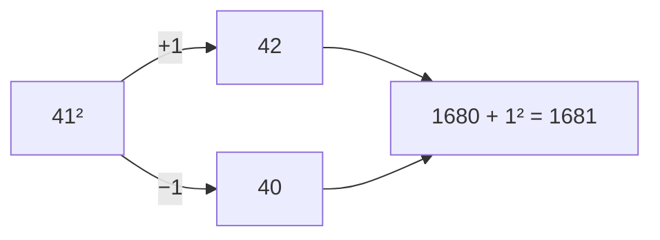
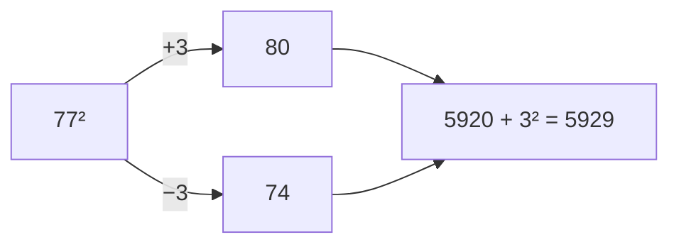

## Why I'm Reading This

To improve my mental math skills

---

# Chapter 1
## Left To Right Addition 

- Read addition **LEFT TO RIGHT** NOT RIGHT TO LEFT
- Add from left to right
Ex:
	$84+57$
1. First add 50
Result:$134+7$
2. Then add 7
Result:$141$
---
## Left To Right Subtraction

- Subtract whole numbers from left to right similar to addition 
Ex:
$53 - 28$
1. Round up so $28$ becomes $30$
2. Subtract $53-30$
3. Result $23$
4. Add back $2$
5. Result $25$

>[!important] Rounding
**Round Up** means add back to result
**Rounding Down** means subtract what was rounded from result

## 3 Digit Subtraction

**Use Complements**
- How far from 100 are certain numbers
Ex:

$$
\begin{array}{r}
37 \\
+63 \\
\hline
100

\end{array}
$$
The key idea is that the **first digit adds up to 9** and the **second digit adds up to 10**

This makes the mental math with 3 digit subtraction easy
$$
\begin{array}{r}
725 \\
\underline{-\ 468 } & \ (500-32)
\end{array}
$$
1. Subtract $500$
2. Result $225$
3. Add back complement so $32$
4. Result $257$

---
# Chapter 2

## 2 By 1 Multiplication

$$
\begin{array}{r}
42 & \ (40+2) \\ 
\times7 \\
\hline
40\times7=280\\
2\times7=+14\\
\hline
294

\end{array}
$$
- Same concept of breaking up from left to right
- Make sure to add 0's based on digit place
- Multiplication with 5 is easier since ends in 0 or 5

## Rounding Up
- Rounding helps but only when rounding numbers that end with an 8 or 9
### Normal
$$
\begin{array}{r}
69 & \ (60+9) \\ 
\times 6 \\
\hline
60\times6=360\\
9\times6=+54\\
\hline
414
\end{array}
$$
### Rounded Up 9
$$
\begin{array}{r}
69 & \ (70-1) \\ 
\times 6 \\
\hline
70\times6=420\\
-1\times6=-6\\
\hline
414
\end{array}
$$
### Rounded Up 8
$$
\begin{array}{r}
78 & \ (80-2) \\ 
\times9 \\
\hline
80\times9=720\\
-2\times9=-18\\
\hline
702
\end{array}
$$
---
## 3 By 1 Multiplication

- Same process as the 2 digit but there is an extra 0
- Difficult part is remember the first sum, with time this will get easier, no trick

## Squaring Two Digit Numbers

- So you try to round a value to it's nearest 10

Ex:

- Notice how we add a number to make it whole 
- Then that number we add just square since 1 digit is easy
